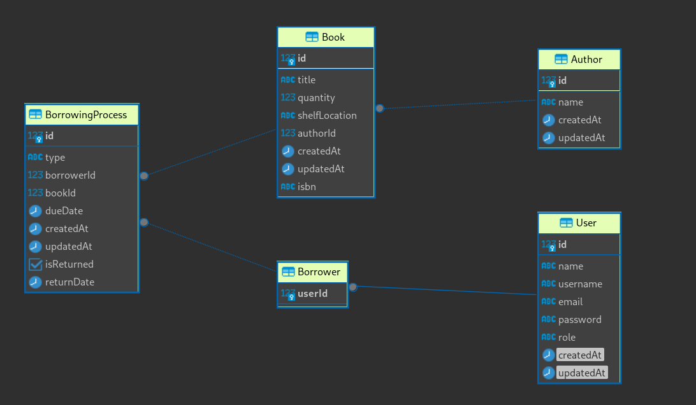

# Library API [(Postman Collection)](https://app.getpostman.com/run-collection/4094492-5c1c1889-78dd-48ad-a3e0-b000dd92a9de?action=collection%2Ffork&source=rip_markdown&collection-url=entityId%3D4094492-5c1c1889-78dd-48ad-a3e0-b000dd92a9de%26entityType%3Dcollection%26workspaceId%3Dc7724042-3341-4f6c-bb25-5b7de55cb01c)


## Running The API 

Firstly, You must have postgres and node installed.
```bash
 sudo su - postgres
 psql
 createdb library
```

Clone the project
```bash
git clone https://github.com/RamyR/Library.git
cd Library
```

```bash
 npm i 
```

To start the Server run.
```bash
 npm start
```

## Structure
The structure is as follows Routes => Views => Middleware + Validators => Controllers => Data Access

```
├── config
│   └── db.js
├── controllers
│   ├── AuthController
│   ├── BookController
│   ├── BorrowerController
│   └── BorrowingProcessController
├── dataAccess
│   ├── Book
│   ├── BorrowingProcess
│   └── User
├── middlewares
│   ├── AuthMiddleware
│   ├── BookMiddleware
│   ├── BorrowerMiddleware
│   ├── BorrowingProcessMiddleware
│   └── RateLimiterMiddleware
├── views
│   ├── AuthView
│   ├── BookView
│   ├── BorrowerView
│   └── BorrowingProcessView
├── routes
│   ├── AuthRoutes
│   ├── BookRoutes
│   ├── BorrowerRoutes
│   ├── BorroweringProcessRoutes
│   └── Routes
├── validators
│   ├── AuthValidator
│   ├── BookValidator
│   ├── BorrowerValidator
│   ├── BorroweringValidator
│   └── PrismaValidator
└── index

```
## Database Diagram


## API Documentation

You can check out the postman documentation from [](https://app.getpostman.com/run-collection/4094492-5c1c1889-78dd-48ad-a3e0-b000dd92a9de?action=collection%2Ffork&source=rip_markdown&collection-url=entityId%3D4094492-5c1c1889-78dd-48ad-a3e0-b000dd92a9de%26entityType%3Dcollection%26workspaceId%3Dc7724042-3341-4f6c-bb25-5b7de55cb01c).

### Requests
Books endpoints
```http
GET    /books/list  rateLimiter
GET    /books/:id
GET    /books/search/:query
POST   /books/create
PUT    /books/update
DELETE /api/books/:id
```

Borrowers endpoints
```http
GET    /borrowers/list   rateLimiter
GET    /borrowers/:id
POST   /borrowers/create
PUT    /borrowers/update
DELETE /borrowers/:id
```

Borrowing Process endpointes

```http
GET    /borroweringProcess/list
POST   /borroweringProcess/checkout
PUT   /borroweringProcess/return
```

System Reports
```http
GET  /books/overdue
```

### Responses

The structure of response 
```javascript
{
    "data": {
    }
}
```
In case of error
```http
{
    "message": "Record To Delete OR Update was not found!",
}
```

### Example Result
Example of Creating a Book endpoint
```http
POST    /books/create
```
Example response
```javascript
{
    "data": {
        "id": 11,
        "title": "Book 15",
        "quantity": 20,
        "isbn": "123asdr",
        "shelfLocation": "2B",
        "authorId": 1,
        "createdAt": "2023-12-05T01:07:40.089Z",
        "updatedAt": "2023-12-05T01:07:40.089Z"
    }
}
}
```